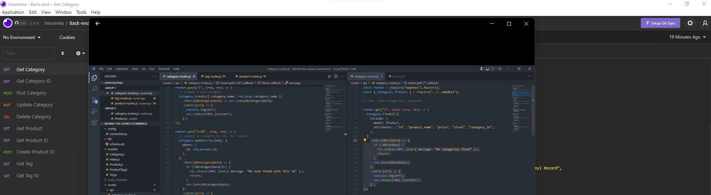

# behind-the-scenes-ecommerce

## Table of Contents

- [Project Description](#Description)
- [Installation](#Installation)
- [Usage](#Usage)
- [Collaborators](#Collaborators)
- [GitHub](#GitHub)

## Description

### Motivation for creating this project

I built this backend application to an e-commerce platform because internet retail is the largest sector of the electronics industry that generates trillions of dollars each year. I one day want to be a part of that.

### What problem does this solve?

This application business owners identify their inventory and keep count of their stock while providing a breif description of the products using tags

## Installation

In order to download and use my code, you will have to clone my repo and install express, sequelize mysql2, and dotenv.

## Usage

Never have a demand higher than your inventory. Keep track of the products that you sell and the quantities you have remaining. Clearly see all of your products by fetching the APIs created for your mechandise.

## Collaborators

I would like to give credit to Xander Rapstine (https://github.com/Xandromus) for being a contributer on this project by providing the starter code.

## Contact Me

See other projects I have created at https://github.com/DouglasRed

Contact me at douglasred63@yahoo.com for any questions you have about my project.

## View My Video

View my video of this project here! https://github.com/DouglasRed/do-note-forget/blob/main/Do%20Note%20Forget.mp4 (Please note: you may have to download this 5 minute video)
